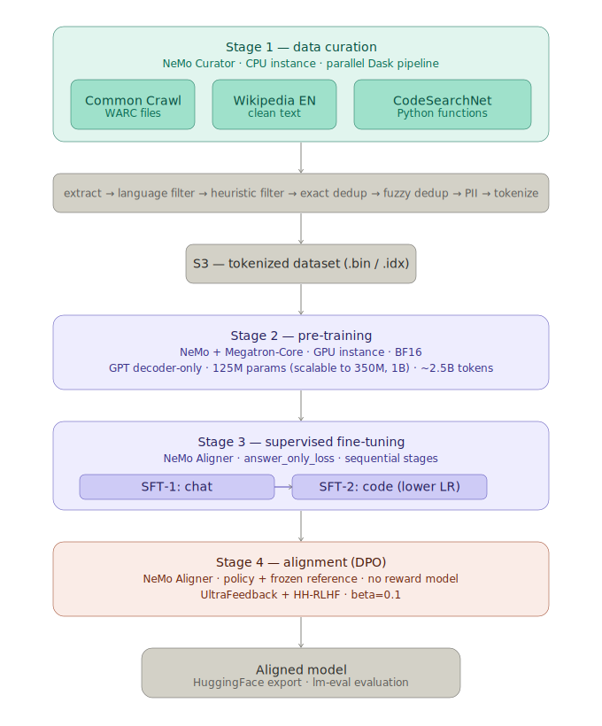

# slm

A decoder-only language model trained from scratch — raw web data through to an aligned, serving-ready model. Covers the full lifecycle: data curation, validation, tokenizer training, pretraining, supervised fine-tuning, preference alignment, evaluation, and production serving.

---

## Overview

Most LLM projects start from a pretrained checkpoint. This one doesn't. SLM is built entirely from scratch — from unstructured web crawl data to an instruction-following, chat-capable model deployed on Kubernetes.

The pipeline is modular and independently runnable at each stage. Every design decision is documented and justified.

**Models:** `tohio/slm-125m` · `tohio/slm-350m` · `tohio/slm-1b`



---

## Architecture

The model is a dense decoder-only transformer with a modern architecture:

| Component | Choice | Rationale |
|---|---|---|
| Positional encoding | RoPE | Better length generalisation, relative position awareness |
| Normalization | RMSNorm | Faster than LayerNorm, modern standard |
| Activation | SwiGLU | Better gradient flow, used by LLaMA, Mistral, Qwen |
| Attention | GQA | Reduces KV memory overhead at inference |
| Bias | None | Simpler, modern standard |
| Embeddings | Tied | Reduces parameters, effective at small scale |

**Model sizes:**

| Model | Layers | Hidden | Q heads | KV heads | Context |
|---|---|---|---|---|---|
| `slm-125m` | 12 | 768 | 12 | 4 | 2048 |
| `slm-350m` | 24 | 1024 | 16 | 8 | 2048 |
| `slm-1b` | 32 | 2048 | 32 | 8 | 4096 |

---

## Tech Stack

| Stage | Tool |
|---|---|
| Data curation | HuggingFace `datasets` + `datatrove` + custom scripts |
| Data validation | `datatrove` |
| Tokenizer | HuggingFace `tokenizers` (BPE) |
| Pretraining | HuggingFace `accelerate` + `transformers` |
| Experiment tracking | Weights & Biases |
| SFT | HuggingFace `trl` (`SFTTrainer`) |
| DPO | HuggingFace `trl` (`DPOTrainer`) |
| Evaluation | `lm-evaluation-harness` |
| Export | HuggingFace `transformers` |
| Inference | HuggingFace `transformers` |
| Serving | `vLLM` on Kubernetes via `ai-infra` |

---

## Repo Structure

```
slm/
├── model/                        Custom decoder-only transformer architecture
│   ├── config.py                 SLMConfig — hyperparameters for 125M/350M/1B
│   ├── attention.py              Grouped Query Attention + RoPE
│   ├── mlp.py                    SwiGLU feed-forward network
│   ├── norm.py                   RMSNorm
│   ├── block.py                  Pre-norm transformer block
│   └── model.py                  SLMModel + SLMForCausalLM
│
├── curator/                      Stage 1: data curation
│   ├── sources/
│   │   ├── wikipedia.py          Wikipedia EN via HuggingFace datasets
│   │   ├── code_search_net.py    CodeSearchNet via HuggingFace datasets
│   │   └── common_crawl.py       Common Crawl WARCs via HTTPS + trafilatura
│   ├── filters/
│   │   ├── quality.py            Heuristic quality filters (FineWeb/Gopher-style)
│   │   └── dedup.py              Exact + datatrove disk-based MinHash deduplication
│   └── scripts/
│       ├── curate.py             Main pipeline entry point
│       └── upload_s3.py          S3 upload/download utilities
│
├── validation/                   Stage 2: data validation
│   └── scripts/validate.py       Quality filter + perplexity filtering
│
├── tokenizer/                    Stage 3: tokenizer training
│   ├── train_tokenizer.py        BPE tokenizer — 32k vocab, 16 special tokens
│   └── test_tokenizer.py         Roundtrip, fertility, chat template tests
│
├── pretrain/                     Stage 4: pretraining
│   ├── configs/                  gpt_125m.yaml, gpt_350m.yaml, gpt_1b.yaml
│   ├── data/
│   │   ├── tokenize.py           JSONL → uint16 memory-mapped binary
│   │   └── dataset.py            PretrainingDataset wrapping .bin file
│   └── train.py                  Pretraining loop
│
├── finetune/                     Stage 5: supervised fine-tuning
│   ├── configs/                  sft_chat/code × 125m/350m/1b (6 configs)
│   ├── data/prepare_sft.py       Chat + code dataset preparation
│   └── train_sft.py              SFT training loop
│
├── alignment/                    Stage 6: preference alignment
│   ├── configs/                  dpo_125m.yaml, dpo_350m.yaml, dpo_1b.yaml
│   ├── data/prepare_dpo.py       Preference dataset blending
│   └── train_dpo.py              DPO training loop
│
├── eval/                         Stage 7: benchmark evaluation
│   └── eval.py                   HellaSwag, ARC, MMLU, TruthfulQA, HumanEval
│
├── export/                       Stage 8: model export
│   └── export.py                 Hub push + model card generation
│
├── inference/                    Stage 9: local inference
│   ├── chat.py                   Interactive multi-turn chat CLI
│   └── generate.py               Batch text generation
│
├── serve/                        Stage 10: production serving
│   ├── manifests/                Kubernetes deployment, service, HPA
│   └── serve.sh                  Local server launch script
│
├── notebooks/                    Exploratory analysis — one per pipeline stage
│   ├── 01_model_exploration.ipynb
│   ├── 02_data_exploration.ipynb
│   ├── 03_validation_exploration.ipynb
│   ├── 04_tokenizer_exploration.ipynb
│   ├── 05_pretrain_exploration.ipynb
│   ├── 06_sft_exploration.ipynb
│   ├── 07_dpo_exploration.ipynb
│   ├── 08_eval_exploration.ipynb
│   └── 09_inference_exploration.ipynb
│
├── docs/
│   ├── architecture.svg          Pipeline architecture diagram
│   └── screenshots/              Pipeline stage screenshots
│
├── infra/
│   ├── setup.sh                  CPU instance bootstrap — curation environment
│   └── setup_gpu_instance.sh     GPU instance bootstrap — training environment
│
├── Makefile                      Full pipeline automation
├── requirements.txt              Python dependencies
├── environment.yml               Conda environment
└── .env.sample                   Environment variable template
```

---

## Getting Started

**Prerequisites**
- Python 3.12+
- CUDA-capable GPU (H100 or A100 recommended for pretraining)
- AWS account (S3 for data storage)
- Weights & Biases account

**Installation**

On a fresh Ubuntu 22.04 cloud instance (recommended):
```bash
git clone https://github.com/tohio/slm.git /data/slm
cd /data/slm

# Default data dir (repo/data)
make setup

# Custom data dir — recommended when using a separate EBS volume
make setup-data-dir DATA_DIR=/data/slm/data
```

Using pip:
```bash
git clone https://github.com/tohio/slm.git
cd slm
pip install -r requirements.txt
pip install https://github.com/kpu/kenlm/archive/master.zip
cp .env.sample .env
# Add your credentials to .env
```

Using uv:
```bash
git clone https://github.com/tohio/slm.git
cd slm
uv venv && source .venv/bin/activate
uv pip install -r requirements.txt
pip install https://github.com/kpu/kenlm/archive/master.zip
cp .env.sample .env
# Add your credentials to .env
```

Using conda:
```bash
git clone https://github.com/tohio/slm.git
cd slm
conda create -n slm python=3.12 -y
conda activate slm
pip install -r requirements.txt
pip install https://github.com/kpu/kenlm/archive/master.zip
cp .env.sample .env
# Add your credentials to .env
```

Then fill in credentials in `.env`:
```
S3_BUCKET=your-bucket
AWS_ACCESS_KEY_ID=...
AWS_SECRET_ACCESS_KEY=...
WANDB_API_KEY=...
HF_TOKEN=...
```

**Validate the pipeline with a mini run (~30 min)**

Before committing to a full run, validate the pipeline end to end:

```bash
source .venv/bin/activate
make curate-mini
```

This caps Wikipedia at 5k docs, CodeSearchNet at 10k samples, and Common
Crawl at 2 WARC segments. Exercises every stage without the wait.

**Run the full pipeline**

```bash
make curate SIZE=125m WORKERS=16    # Stage 1: download and curate data
make curate-upload SIZE=125m        # Stage 1: push curated data to S3
make download-kenlm-model           # one-time: download KenLM model (~4GB)
make validate                       # Stage 2: quality filter and validate
make tokenizer                      # Stage 3: train tokenizer
make tokenize                       # Stage 4a: tokenize dataset
make pretrain GPUS=4                # Stage 4b: pretrain slm-125m
make sft GPUS=4                     # Stage 5: chat SFT
make sft-code GPUS=4                # Stage 5: code SFT
make dpo GPUS=2                     # Stage 6: DPO alignment
make eval                           # Stage 7: evaluate on benchmarks
make export                         # Stage 8: export to HuggingFace Hub
make serve                          # Stage 10: launch vLLM server (Hub model)
make serve-local                    # Stage 10: launch vLLM server (local checkpoint)
```

**Run curation sub-stages individually**

```bash
make curate-download SIZE=125m
make curate-filter   SIZE=125m
make curate-dedup    SIZE=125m WORKERS=16
make curate-blend    SIZE=125m
make curate-upload   SIZE=125m
```

**Multi-GPU training**

```bash
make pretrain SIZE=125m GPUS=4
make pretrain SIZE=350m GPUS=6
make pretrain SIZE=1b   GPUS=8

# Override config directly
make pretrain CONFIG=pretrain/configs/gpt_125m.yaml GPUS=4
make sft      CONFIG=finetune/configs/sft_chat_125m.yaml GPUS=4
make dpo      CONFIG=alignment/configs/dpo_125m.yaml GPUS=2
```

**Interactive chat**

```bash
python inference/chat.py --model tohio/slm-125m
```

---

## Infrastructure

Recommended instance specs per target:

| Target | Instance | RAM | Est. runtime |
|---|---|---|---|
| mini (validation) | Any CPU | 4GB+ | ~30–45 min |
| 125m | `c8g.4xlarge` (16 vCPU) | 32GB | ~6–8 hrs |
| 350m | `c8g.4xlarge` (16 vCPU) | 32GB | ~18–24 hrs |
| 1b | `c8g.8xlarge` (32 vCPU) | 64GB | ~48–72 hrs |

Run curation on AWS spot in `us-east-1` to minimise Common Crawl egress
latency. Attach an EBS volume (`gp3`, 500GB) for `DATA_DIR` so data
survives spot interruptions — the pipeline is fully resumable at every stage.

Use `tmux` to keep the pipeline running through SSM session timeouts:
```bash
tmux new -s curate
source .venv/bin/activate
make curate SIZE=125m WORKERS=16
# Ctrl+B, D to detach — tmux attach -t curate to reattach
```

---

## Key Design Decisions

**Why from scratch?** Starting from an existing checkpoint is the right production choice. We start from scratch deliberately — it exercises every stage of the pipeline and provides full visibility into how data quality and tokenizer design interact with training dynamics.

**Why a custom tokenizer?** A tokenizer trained on your specific data mix encodes domain patterns more efficiently. Special tokens (`<|user|>`, `<|assistant|>`, `<|code|>`, `<|endofturn|>`) are baked in from the start, giving the model a clean chat template without retrofitting.

**Why GQA over MHA?** At inference time, KV cache is the primary memory bottleneck. GQA reduces KV heads from 12 to 4 (125m) — a 3x reduction in KV memory with negligible quality loss. Directly improves throughput in vLLM.

**Why DPO over PPO?** At small model scale, PPO's actor-critic setup requires multiple models simultaneously and is sensitive to reward scaling. DPO achieves comparable alignment with a simpler training loop and no separate reward model.

**Why sequential SFT (chat → code)?** Sequential fine-tuning produces independently evaluable checkpoints at each stage, making regressions immediately visible. The code SFT uses a lower learning rate to reduce catastrophic forgetting of chat capability.

**Why vLLM for serving?** PagedAttention enables continuous batching and efficient KV cache management. The OpenAI-compatible API means any client built against the OpenAI SDK works out of the box — no custom client code.

**Why datatrove for dedup instead of datasketch?** datasketch's `MinHashLSH` is in-memory — at 350m scale it requires ~32GB RAM, at 1b it requires ~85GB and cannot fit on a single instance. datatrove's disk-based pipeline uses a sort-based approach where RAM usage is bounded by shard size, not corpus size. Same approach used by FineWeb at trillion-token scale.

**Why HTTPS for Common Crawl instead of S3?** Direct S3 access to the `commoncrawl` bucket fails on EC2 instances with IAM roles attached — the instance role credentials are rejected by the bucket policy. HTTPS via `data.commoncrawl.org` works reliably regardless of instance credentials.

---

## Evaluation

Models are evaluated on standard benchmarks via `lm-evaluation-harness`:

| Benchmark | Measures |
|---|---|
| HellaSwag | Commonsense reasoning |
| ARC-Easy / ARC-Challenge | Science QA |
| MMLU | Broad knowledge |
| TruthfulQA | Factual accuracy |
| HumanEval | Code generation |

---

## Production Serving

The `serve/manifests/` directory contains Kubernetes manifests deployed via [ai-infra](https://github.com/tohio/ai-infra) using ArgoCD. The vLLM server exposes an OpenAI-compatible REST API and a Prometheus `/metrics` endpoint scraped by the cluster monitoring stack.

```bash
# Query the model via OpenAI-compatible API
curl http://slm-service:8000/v1/chat/completions \
  -H "Content-Type: application/json" \
  -d '{
    "model": "slm-125m",
    "messages": [{"role": "user", "content": "Hello"}]
  }'
```

---

## Production Considerations

This project is scoped as a complete end-to-end training pipeline and demonstration. In a larger production system:

- **Data scale** — the curation pipeline would run on a distributed compute cluster over petabyte-scale crawl data rather than a single CPU instance.
- **Training scale** — multi-node training with FSDP or tensor parallelism across 8+ GPUs for the 1B model.
- **Continual learning** — a data flywheel feeding new curated data back into periodic pretraining runs.
- **Reward modelling** — a trained reward model enabling PPO or online DPO for more sophisticated alignment.
- **Observability** — per-request latency, token throughput, and generation quality metrics surfaced in Grafana.

---

## Related Projects

- [ai-infra](https://github.com/tohio/ai-infra) — Kubernetes platform that deploys and operates this model in production
- [rag-pipeline](https://github.com/tohio/rag-pipeline) — RAG pipeline that can use slm as the base LLM
- [multi-agent](https://github.com/tohio/multi-agent) — autonomous multi-agent investment research
- [data-flywheel](https://github.com/tohio/data-flywheel) — self-improving data pipeline feeding into future SLM training runs

---

## License

MIT