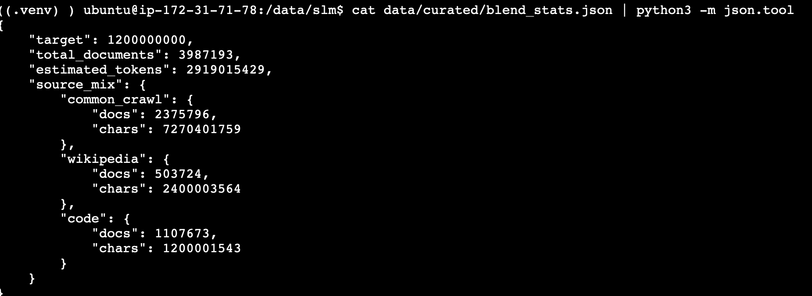
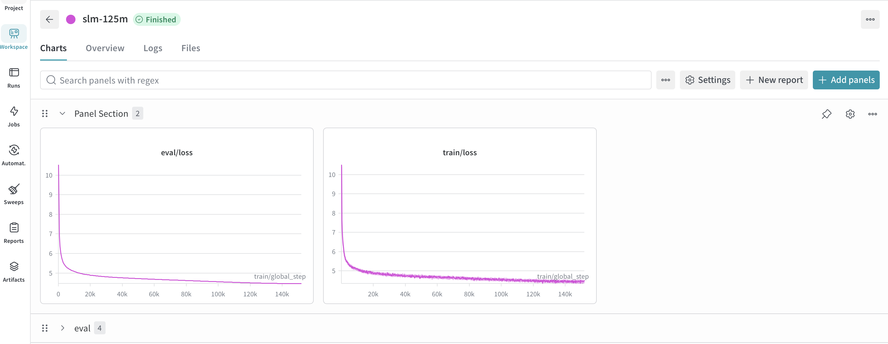
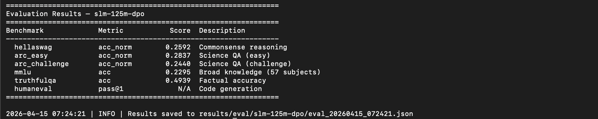

# slm

A decoder-only language model trained from scratch — raw web data through to an aligned, serving-ready model. Covers the full lifecycle: data curation, validation, tokenizer training, pretraining, supervised fine-tuning, preference alignment, evaluation, and production serving.

---

## Overview

Most LLM projects start from a pretrained checkpoint. This one doesn't. SLM is built entirely from scratch — from unstructured web crawl data to an instruction-following, chat-capable model deployed on Kubernetes.

The pipeline is modular and independently runnable at each stage. Every design decision is documented and justified.

**Models:** `tohio/slm-125m` · `tohio/slm-125m-instruct` · `tohio/slm-125m-chat` · `tohio/slm-350m` · `tohio/slm-350m-instruct` · `tohio/slm-350m-chat` · `tohio/slm-1b` · `tohio/slm-1b-instruct` · `tohio/slm-1b-chat`


---

## Architecture

The model is a dense decoder-only transformer with a modern architecture:

| Component | Choice | Rationale |
|---|---|---|
| Positional encoding | RoPE | Better length generalisation, relative position awareness |
| Normalization | RMSNorm | Faster than LayerNorm, modern standard |
| Activation | SwiGLU | Better gradient flow, used by LLaMA, Mistral, Qwen |
| Attention | GQA | Reduces KV memory overhead at inference |
| Bias | None | Simpler, modern standard |
| Embeddings | Tied | Reduces parameters, effective at small scale |

**Model sizes:**

| Model | Layers | Hidden | Q heads | KV heads | Context |
|---|---|---|---|---|---|
| `slm-125m` | 12 | 768 | 12 | 4 | 2048 |
| `slm-350m` | 24 | 1024 | 16 | 8 | 2048 |
| `slm-1b` | 32 | 2048 | 32 | 8 | 4096 |

---

## Tech Stack

| Stage | Tool |
|---|---|
| Data curation | HuggingFace `datasets` + `datatrove` + custom scripts |
| Data validation | `datatrove` + KenLM perplexity filtering |
| Tokenizer | HuggingFace `tokenizers` (BPE, 32k vocab) |
| Pretraining | HuggingFace `accelerate` + `transformers` |
| Experiment tracking | Weights & Biases |
| SFT | HuggingFace `trl` (`SFTTrainer`) |
| DPO | HuggingFace `trl` (`DPOTrainer`) |
| Evaluation | `lm-evaluation-harness` |
| Export | HuggingFace `transformers` |
| Inference | HuggingFace `transformers` |
| Serving | `vLLM` on Kubernetes via `ai-infra` |

---

## Repo Structure

```
slm/
├── model/
│   ├── config.py
│   ├── attention.py
│   ├── mlp.py
│   ├── norm.py
│   ├── block.py
│   └── model.py
│
├── curator/
│   ├── sources/
│   │   ├── wikipedia.py
│   │   ├── code_search_net.py
│   │   └── common_crawl.py
│   ├── filters/
│   │   ├── quality.py
│   │   └── dedup.py
│   └── scripts/
│       ├── curate.py
│       └── upload_s3.py
│
├── validation/
│   └── scripts/
│       ├── validate.py
│       └── upload_validated.py
│
├── tokenizer/
│   ├── train_tokenizer.py
│   └── test_tokenizer.py
│
├── pretrain/
│   ├── configs/
│   ├── data/
│   │   ├── tokenize_data.py
│   │   ├── upload_tokenized.py
│   │   └── dataset.py
│   └── train.py
│
├── finetune/
│   ├── configs/
│   ├── data/prepare_sft.py
│   └── train_sft.py
│
├── alignment/
│   ├── configs/
│   ├── data/prepare_dpo.py
│   └── train_dpo.py
│
├── eval/
│   └── eval.py
│
├── export/
│   └── export.py
│
├── inference/
│   ├── chat.py
│   └── generate.py
│
├── serve/
│   ├── manifests/
│   │   ├── deployment.yaml
│   │   ├── service.yaml
│   │   ├── hpa.yaml
│   │   └── pvc.yaml
│   └── serve.sh
│
├── tests/                                  
│   ├── conftest.py                         
│   ├── README.md                           
│   ├── data_pipeline/                      
│   │   ├── test_pipeline_curator.py        
│   │   ├── test_pipeline_validate.py       
│   │   └── test_pipeline_tokenizer.py      
│   ├── model/
│   │   └── test_model.py                   
│   └── gpu_pipeline/                       
│       ├── test_pipeline_training.py       
│       ├── test_pipeline_sft.py            
│       └── test_pipeline_dpo.py            
│
├── notebooks/                    Exploratory analysis — one per pipeline stage
│   ├── 01_model_exploration.ipynb
│   ├── 02_data_exploration.ipynb
│   ├── 03_validation_exploration.ipynb
│   ├── 04_tokenizer_exploration.ipynb
│   ├── 05_pretrain_exploration.ipynb
│   ├── 06_sft_exploration.ipynb
│   ├── 07_dpo_exploration.ipynb
│   ├── 08_eval_exploration.ipynb
│   └── 09_inference_exploration.ipynb
│
├── docs/
│   ├── COMMANDS.md
│   ├── DISK_SETUP.md
│   ├── architecture.svg
│   └── screenshots/
│
├── infra/
│   ├── setup.sh
│   └── setup_gpu_instance.sh
│
├── accelerate_configs/
│   ├── single_gpu.yaml
│   └── multi_gpu.yaml
│
├── Makefile
├── pytest.ini
├── requirements.txt
├── environment.yml
└── .env.sample

this is the repo structure it needs to be updated as well
```

---

## Getting Started

**Prerequisites**
- Python 3.12+
- Ubuntu 24.04 (recommended — `setup.sh` targets noble)
- CUDA-capable GPU (for pretraining stages)
- AWS account (S3 for data storage)
- Weights & Biases account

**Disk setup (separate data volume)**

If you are attaching a secondary disk for your data directory (recommended for
curation — you need 500GB+), mount it before cloning:

→ [docs/DISK_SETUP.md](docs/DISK_SETUP.md)

If you are using the boot disk only, skip this step.

**Installation**

On a fresh Ubuntu 24.04 cloud instance (recommended):
```bash
# Clone into /data/slm — requires /data to exist and be writable.
# If using a separate disk, complete docs/DISK_SETUP.md first.
git clone https://github.com/tohio/slm.git /data/slm
cd /data/slm

cp .env.sample .env
vi .env   # fill in S3_BUCKET, AWS credentials, WANDB_API_KEY, HF_TOKEN

sudo apt install -y make

# Custom data dir — recommended when using a separate disk volume
make setup-data-dir DATA_DIR=/data/slm/data

# Default data dir (repo/data) — boot disk only
# make setup
```

Using pip:
```bash
make install          # creates .venv and installs all dependencies
make install-kenlm    # kenlm not on PyPI — curation instance only
```

Using uv:
```bash
make install-uv
make install-kenlm
```

Using conda:
```bash
make install-conda
make install-kenlm
```

GPU training instance only:
```bash
make install-gpu      # skips kenlm and other curation-only dependencies
```

---

**Run the full pipeline**

```bash
# ── Step 1: Curation instance (CPU) ──────────────────────────────────────────
make download-fasttext-model DATA_DIR=/data/slm/data   # language ID model (~1MB)
make download-kenlm-model    DATA_DIR=/data/slm/data   # perplexity model (~4GB)

# ── Step 2: Validate curation pipeline ───────────────────────────────────────
# Exercises every curation stage end-to-end on tiny data.
# All tests run here — catch issues before spending hours on the full run.
make curate-mini && make test-curator
make validate    && make test-validate
make tokenizer   && make test-tokenizer
make tokenize
make tokenize-upload SIZE=mini    # push mini tokenized binary to S3 for GPU instance
make tokenizer-upload             # push tokenizer to S3 (shared across all sizes)

# ── Step 3: Full curation ─────────────────────────────────────────────────────
make curate SIZE=125m WORKERS=62    # Stage 1: download, filter, dedup, blend, upload
make validate                       # Stage 2: perplexity filter
make validate-upload SIZE=125m      # Stage 2: push validated data to S3
make tokenizer                      # Stage 3: train BPE tokenizer
make tokenizer-upload               # Stage 3: push tokenizer to S3
make tokenize                       # Stage 4a: tokenize to binary
make tokenize-upload SIZE=125m      # Stage 4a: push tokenized binary to S3

# ── Step 4: GPU instance setup ───────────────────────────────────────────────
# For mini validation — pulls mini tokenized binary and tokenizer from S3
make setup-gpu DATA_DIR=/data/slm/data SIZE=mini DATE=YYYY-MM-DD
source ~/.bashrc

# ── Step 5: Validate training pipeline ───────────────────────────────────────
# Exercises every training stage end-to-end on a single GPU.
# All tests run here — catch issues before spending hours on the full run.
make accelerate-config-single       # single GPU for mini validation
make pretrain-mini  GPUS=1 && make test-training
make prepare-sft
make sft-mini       GPUS=1 && make test-sft-chat
make sft-code-mini  GPUS=1 && make test-sft-code
make prepare-dpo
make dpo-mini       GPUS=1 && make test-dpo
make eval-mini

# ── Step 6: Full training ─────────────────────────────────────────────────────
# Before running, update gradient_accumulation_steps and max_steps in
# pretrain/configs/gpt_125m.yaml, alignment/configs/dpo_125m.yaml,
# finetune/configs/sft_chat_125m.yaml, finetune/configs/sft_code_125m.yaml for your GPU count.
# See docs/COMMANDS.md — Multi-GPU Config Scaling for exact values.
# Re-run setup-gpu to pull the 125m tokenized binary before training.
make setup-gpu DATA_DIR=/data/slm/data SIZE=125m DATE=YYYY-MM-DD
make accelerate-config-single        # single GPU — change to: make accelerate-config-multi GPUS=x for multi-GPU
make pretrain  SIZE=125m GPUS=1      # Stage 4b: pretrain from scratch
make export-base     SIZE=125m       # Stage 8:  push base model to Hub
make sft       SIZE=125m GPUS=1      # Stage 5b: chat SFT
make sft-code  SIZE=125m GPUS=1      # Stage 5c: code SFT
make export-instruct SIZE=125m       # Stage 8:  push instruct model to Hub
make dpo       SIZE=125m GPUS=1      # Stage 6b: DPO alignment
make eval      SIZE=125m             # Stage 7:  benchmark evaluation
make export-chat     SIZE=125m       # Stage 8:  push chat model to Hub
make serve                           # Stage 10: launch vLLM server
```

For full documentation of every `make` target see [docs/COMMANDS.md](docs/COMMANDS.md).

---

## Tests

Tests validate real pipeline outputs at each stage. Each test target is paired with the make stage that produces the outputs it checks. See [tests/README.md](tests/README.md) for full documentation.

**CPU curation instance:**

```bash
make curate-mini   && make test-curator      # validate curation outputs
make validate      && make test-validate     # validate validation outputs
make tokenizer     && make test-tokenizer    # validate tokenizer outputs

make test-data-pipeline                      # run all three at once
```

**GPU training instance:**

```bash
make pretrain-mini  GPUS=1  && make test-training    # validate pretraining
make sft-mini       GPUS=1  && make test-sft-chat    # validate chat SFT
make sft-code-mini  GPUS=1  && make test-sft-code    # validate code SFT
make dpo-mini       GPUS=1  && make test-dpo         # validate DPO

make test-gpu-pipeline                               # run all four at once
```

**Model unit tests — no pipeline outputs needed, runs anywhere:**

```bash
make test-model
```

| Target | Stage | Validates |
|---|---|---|
| `test-curator` | `curate-mini` | Raw shards, filter quality, dedup correctness, blend output, stats |
| `test-validate` | `validate` | Retention rate, subset correctness, quality of retained docs |
| `test-tokenizer` | `tokenizer` | Special token IDs, roundtrip, fertility, chat template |
| `test-data-pipeline` | all three above | Runs curator + validate + tokenizer tests |
| `test-training` | `pretrain-mini` | Model loads, loss finite and below random init, dataset indexing |
| `test-sft-chat` | `sft-mini` | SFT data format, model loads, chat template preserved, generation runs |
| `test-sft-code` | `sft-code-mini` | Code model loads, loss finite, code special tokens present |
| `test-dpo` | `dpo-mini` | DPO data format, chosen ≠ rejected, model loads, generation runs |
| `test-gpu-pipeline` | all four above | Runs training + sft-chat + sft-code + dpo tests |
| `test-model` | none | RMSNorm, SwiGLU, GQA, causal mask, weight tying, parameter count |

---

## Multi-GPU Config Scaling

> **Important:** All training configs — pretrain, SFT, and DPO — are written
> for **1 GPU**. Before running multi-GPU training at any stage, scale the
> config to preserve the global batch size and token budget:
>
> ```
> gradient_accumulation_steps = original / num_gpus
> max_steps                   = original / num_gpus   # pretrain only
> ```
>
> Each config file includes a comment with exact values for 1, 4, and 8 GPUs.
> This must be done for **every stage** — pretrain, SFT chat, SFT code, and DPO.

| Stage | Config location | Scaling fields |
|---|---|---|
| Pretrain | `pretrain/configs/gpt_{size}.yaml` | `gradient_accumulation_steps`, `max_steps` |
| SFT chat | `finetune/configs/sft_chat_{size}.yaml` | `gradient_accumulation_steps` |
| SFT code | `finetune/configs/sft_code_{size}.yaml` | `gradient_accumulation_steps` |
| DPO | `alignment/configs/dpo_{size}.yaml` | `gradient_accumulation_steps` |

Note: SFT and DPO use `epochs` not `max_steps` — only `gradient_accumulation_steps` needs adjusting for those stages.

```bash
make pretrain  SIZE=125m GPUS=8
make sft       SIZE=125m GPUS=8
make sft-code  SIZE=125m GPUS=8
make dpo       SIZE=125m GPUS=8

# Override config directly
make pretrain CONFIG=pretrain/configs/gpt_125m.yaml GPUS=4
```

---

## Data

### Source Mix

| Source | Mix | Tokens (1b) | Notes |
|---|---|---|---|
| Common Crawl | 55% | 16.5B | Broad web coverage, aggressively filtered |
| Wikipedia EN | 25% | 7.5B | High quality, factual, structured |
| CodeSearchNet | 20% | 6B | Python only |

### Token Targets

| Model | Total tokens | Epochs |
|---|---|---|
| `slm-125m` | 5B | 2 |
| `slm-350m` | 15B | 2 |
| `slm-1b` | 30B | 2 |

---

## Infrastructure

### Data Curation (CPU) — Stages 1–4a

Runs on CPU instances. No GPU required.

| Target | vCPUs | RAM | Est. runtime |
|---|---|---|---|
| mini (validation) | Any | 4GB+ | ~30–45 min |
| 125m | 32 vCPU | 64GB | ~4–6 hrs |
| 350m | 64 vCPU | 128GB | ~10–14 hrs |
| 1b | 64 vCPU | 256GB | ~20–28 hrs |

> **Runtimes are rough reference points — measure your own.**
> Many variables dominate: network peering between your cloud and Common
> Crawl's AWS `us-east-1` origin, per-WARC CloudFront throughput at your
> time of day, disk IOPS, CPU generation, and CC's own throttling behavior.
> Cross-cloud (Nebius → AWS, GCP → AWS) runs can be 2–3× faster or slower
> than same-region (AWS `us-east-1`) runs. Before committing to a full 1b
> run, time a `curate-mini` or `curate SIZE=125m` run to calibrate your
> actual throughput.

Run close to `us-east-1` (AWS) or `us-east1` (GCP) to minimise Common Crawl egress latency. Attach a persistent disk (500GB+) for `DATA_DIR` — the pipeline is fully resumable at every stage.

Use `tmux` to keep the pipeline running through session timeouts:
```bash
tmux new -s curate
make curate SIZE=125m WORKERS=62
# Ctrl+B, D to detach — tmux attach -t curate to reattach
```

### Training (GPU) — Stages 4b–6

Requires a CUDA-capable GPU instance. The pipeline uses **pure data parallelism** throughout all model sizes — no tensor parallelism or model parallelism is needed. The model is replicated on each GPU and the batch is split across GPUs.

> **Before running multi-GPU training at any stage:** Update
> `gradient_accumulation_steps` in the pretrain, SFT, and DPO configs for
> your GPU count. For pretrain, also update `max_steps`. Each config includes
> a scaling comment with exact values for 1, 4, and 8 GPUs.

Runtime varies significantly by GPU type and count. Use `make pretrain-mini GPUS=1` first to validate the training loop and measure your actual throughput before committing to a full run.

| Target | Min VRAM | Notes |
|---|---|---|
| mini (validation) | 8GB+ | Any GPU — confirms training loop works |
| 125m | 16GB+ per GPU | Fits on any modern data center GPU |
| 350m | 24GB+ per GPU | A100 40GB or better recommended |
| 1b | 40GB+ per GPU | A100 80GB / H100 / H200 recommended; gradient checkpointing enabled |

SFT and DPO runtimes are roughly 20–30% of pretraining time at the same model size. Use spot/preemptible instances — all training loops support `--resume` from the last checkpoint.

---

## Screenshots

| Screenshot | Stage | Description |
|---|---|---|
| `docs/screenshots/01_blend_stats.png` | Stage 1 | `blend_stats.json` showing 55/25/20 source mix |
| `docs/screenshots/02_validation_report.png` | Stage 2 | Validation report — total, kept, and rejection breakdown |
| `docs/screenshots/03_tokenizer_test.png` | Stage 3 | Tokenizer test output — special tokens and fertility score |
| `docs/screenshots/04_pretrain_loss.png` | Stage 4 | W&B pretraining loss curve |
| `docs/screenshots/05_sft_loss.png` | Stage 5 | W&B chat SFT loss curve |
| `docs/screenshots/06_dpo_loss.png` | Stage 6 | W&B DPO loss curve |
| `docs/screenshots/07_eval_results.png` | Stage 7 | Benchmark results — HellaSwag, ARC, MMLU, TruthfulQA, HumanEval |
| `docs/screenshots/08_hf_hub.png` | Stage 8 | HuggingFace Hub model page for `tohio/slm-125m` |
| `docs/screenshots/09_chat_session.png` | Stage 9 | Interactive multi-turn chat session via `inference/chat.py` |
| `docs/screenshots/10_vllm_curl.png` | Stage 10 | `curl` request to vLLM server with response |

### Stage 1 — Data Curation

Source mix breakdown from `blend_stats.json` — confirming the 55/25/20 Common Crawl / Wikipedia / code split.



### Stage 4 — Pretraining

W&B loss curve showing steady convergence over the full pretraining run.



### Stage 7 — Evaluation

Benchmark results across HellaSwag, ARC, MMLU, TruthfulQA, and HumanEval.



### Stage 9 — Inference

Multi-turn chat session via `inference/chat.py` using the aligned chat model.


---

## Evaluation

Models are evaluated on standard benchmarks via `lm-evaluation-harness`:

| Benchmark | Measures |
|---|---|
| HellaSwag | Commonsense reasoning |
| ARC-Easy / ARC-Challenge | Science QA |
| MMLU | Broad knowledge |
| TruthfulQA | Factual accuracy |
| HumanEval | Python code generation |

---

## Key Design Decisions

**Why from scratch?** Starting from an existing checkpoint is the right production choice. We start from scratch deliberately — it exercises every stage of the pipeline and provides full visibility into how data quality and tokenizer design interact with training dynamics.

**Why a custom tokenizer?** A tokenizer trained on your specific data mix encodes domain patterns more efficiently. Special tokens (`<|system|>`, `<|user|>`, `<|assistant|>`, `<|code|>`, `<|endofturn|>` and more) are baked in from the start with a Jinja2 chat template, giving the model a clean and consistent format across pretraining, SFT, DPO, and inference.

**Why GQA over MHA?** At inference time, KV cache is the primary memory bottleneck. GQA reduces KV heads from 12 to 4 (125m) — a 3× reduction in KV memory with negligible quality loss. Directly improves throughput in vLLM.

**Why DPO over PPO?** At small model scale, PPO's actor-critic setup requires multiple models simultaneously and is sensitive to reward scaling. DPO achieves comparable alignment with a simpler training loop and no separate reward model.

**Why sequential SFT (chat → code)?** Sequential fine-tuning produces independently evaluable checkpoints at each stage, making regressions immediately visible. The code SFT uses a lower learning rate to reduce catastrophic forgetting of chat capability.

**Why Python-only for code?** CodeSearchNet's Go and Rust corpora are thin, and including weak language coverage adds noise without meaningful benefit. Python has the strongest coverage, the highest quality docstrings, and the best downstream evaluation benchmarks (HumanEval). A focused 20% Python corpus outperforms a diluted multi-language mix at this scale.

**Why vLLM for serving?** PagedAttention enables continuous batching and efficient KV cache management. The OpenAI-compatible API means any client built against the OpenAI SDK works out of the box.

**Why datatrove for dedup instead of datasketch?** datasketch's `MinHashLSH` is in-memory — at 350m scale it requires ~32GB RAM. datatrove's disk-based pipeline uses a sort-based approach where RAM usage is bounded by shard size, not corpus size. Same approach used by FineWeb at trillion-token scale.

**Why HTTPS for Common Crawl instead of S3?** Direct S3 access to the `commoncrawl` bucket fails on EC2 instances with IAM roles attached — the instance role credentials are rejected by the bucket policy. HTTPS via `data.commoncrawl.org` works reliably regardless of instance credentials.

**Why fasttext for language detection?** Language detection runs on every Common Crawl document — tens of millions of pages. `langdetect` is pure Python and adds ~5–10ms per document. fasttext's `lid.176.ftz` model is C-backed, covers 176 languages, and runs ~1000× faster with equivalent accuracy.

---

## Production Serving

The `serve/manifests/` directory contains Kubernetes manifests deployed via [ai-infra](https://github.com/tohio/ai-infra) using ArgoCD. The vLLM server exposes an OpenAI-compatible REST API:

```bash
curl http://slm-service:8000/v1/chat/completions \
  -H "Content-Type: application/json" \
  -d '{
    "model": "slm-125m",
    "messages": [{"role": "user", "content": "Hello"}]
  }'
```

---

## Production Considerations

This project is scoped as a complete end-to-end training pipeline and demonstration. In a larger production system:

- **Data scale** — the curation pipeline would run on a distributed compute cluster over petabyte-scale crawl data rather than a single CPU instance.
- **Training scale** — multi-node training with FSDP across 8+ nodes for the 1B model and beyond.
- **Continual learning** — a data flywheel feeding new curated data back into periodic pretraining runs.
- **Reward modelling** — a trained reward model enabling online DPO for more sophisticated alignment.
- **Observability** — per-request latency, token throughput, and generation quality metrics surfaced in Grafana.

---

## Related Projects

- [ai-infra](https://github.com/tohio/ai-infra) — Kubernetes platform that deploys and operates this model in production
- [rag-pipeline](https://github.com/tohio/rag-pipeline) — RAG pipeline that can use slm as the base LLM
- [multi-agent](https://github.com/tohio/multi-agent) — autonomous multi-agent investment research
- [data-flywheel](https://github.com/tohio/data-flywheel) — self-improving data pipeline feeding into future SLM training runs

---

## License

MIT