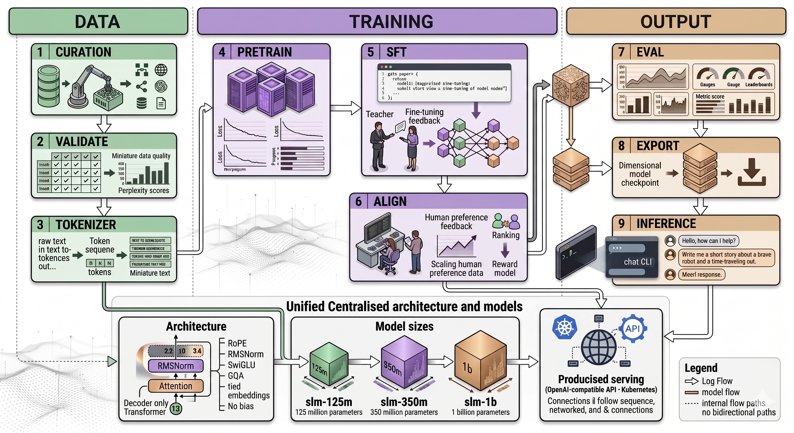

# slm

End-to-end decoder-only language model pipeline: data curation, validation, tokenizer training, pretraining, supervised fine-tuning, DPO alignment, export, inference, and serving.

This repository is intentionally stage-based. The root README gives the project map and the common path through the pipeline. Stage-specific details live in the folder READMEs.



---

## What this repo builds

| Variant | Checkpoint | Hub name |
|---|---|---|
| base | `results/runs/<size>/pretrain/final` | `tohio/slm-<size>` |
| instruct | `results/runs/<size>/sft_instruct/final` | `tohio/slm-<size>-instruct` |
| chat | `results/runs/<size>/dpo_chat/final` | `tohio/slm-<size>-chat` |
| code | `results/runs/<size>/sft_code/final` | `tohio/slm-<size>-code` |

Lineage:

```text
pretrain/final
  ↓
sft_instruct/final
  ├── dpo_chat/final
  └── sft_code/final
```

---

## Repository layout

| Path | Purpose |
|---|---|
| `config/` | data mix and token targets |
| `config_gen/` | hardware-aware config generation |
| `curator/` | source loading, filtering, dedup, blending, artifact upload/download |
| `validation/` | post-curation quality validation |
| `tokenizer/` | BPE tokenizer training and tokenizer checks |
| `pretrain/` | tokenization and base model pretraining |
| `model/` | custom decoder-only Transformer implementation |
| `finetune/` | instruct SFT, code SFT, response-control data |
| `alignment/` | DPO preference alignment for chat model |
| `eval/` | optional benchmark and sanity evaluation |
| `export/` | Hugging Face export, tokenizer packaging, remote-code bundling |
| `inference/` | local chat and generation utilities |
| `serve/` | vLLM serving assets |
| `tests/` | data, GPU, model, and config tests |
| `docs/` | command reference and infrastructure notes |

---

## Supported sizes

```text
mini   pipeline validation
125m   first full target
350m   larger target
1b     largest configured target
```

Token targets are defined in `config/data_mix.py`. Hardware guidance is in `HARDWARE.md`.

---

## Prerequisites

Core local setup:

```bash
git clone https://github.com/tohio/slm.git
cd slm/
python3 -m venv .venv
source .venv/bin/activate
pip install -r requirements.txt
cp .env.sample .env
```

Common environment variables:

```bash
DATA_DIR=data
RESULTS_DIR=results
HF_TOKEN=...
HF_USERNAME=
S3_BUCKET=...
S3_PREFIX=...
```

Use `DATA_DIR` on persistent storage for full curation and training runs.

---

## Common pipeline

### CPU/data instance

```bash
make setup-data-dir DATA_DIR=/data/slm/data
make install
make install-kenlm
make download-fasttext-model DATA_DIR=/data/slm/data
make download-kenlm-model DATA_DIR=/data/slm/data

make curate SIZE=125m WORKERS=62
make validate SIZE=125m
make tokenizer SIZE=125m
make tokenize SIZE=125m
make artifacts-upload SIZE=125m
```

For a small pipeline check:

```bash
make curate-mini
make validate SIZE=mini
make tokenizer SIZE=mini
make tokenize SIZE=mini
make artifacts-upload SIZE=mini
```

### GPU/training instance

Restore tokenized artifacts by `RUN_ID`:

```bash
make setup-gpu DATA_DIR=/data/slm/data SIZE=125m RUN_ID=125m-20260629-a8f3c9
make accelerate-config-single
make config-gen SIZE=125m GPUS=1
```

Train the main variants:

```bash
make pretrain SIZE=125m GPUS=1
make reinit-embeds SIZE=125m

make prepare-sft SIZE=125m
make sft-instruct SIZE=125m GPUS=1
make sft-code SIZE=125m GPUS=1

make prepare-dpo SIZE=125m
make dpo-chat SIZE=125m GPUS=1
```

Export:

```bash
make export-base SIZE=125m
make export-instruct SIZE=125m
make export-chat SIZE=125m
make export-code SIZE=125m
```

Detailed commands are in `docs/COMMANDS.md`.

---

## RUN_ID artifacts

Reusable data artifacts are grouped by run ID, not date.

Local layout:

```text
data/runs/<size>/RUN_ID
data/runs/<size>/<stage>/
```

S3 layout:

```text
<S3_PREFIX>/<size>/<run_id>/<stage>/
```

Valid stages:

```text
raw, curated, validated, tokenized, tokenizer, metadata
```

Upload:

```bash
make artifacts-upload SIZE=125m
make artifacts-upload SIZE=125m RUN_ID=125m-20260629-a8f3c9
```

Download:

```bash
make artifacts-download SIZE=125m RUN_ID=125m-20260629-a8f3c9
```

GPU setup also requires `RUN_ID` when restoring from S3:

```bash
make setup-gpu DATA_DIR=/data/slm/data SIZE=125m RUN_ID=125m-20260629-a8f3c9
```

---

## Testing

Core checks:

```bash
make test-curator
make test-validate
make test-tokenizer
make test-model
make test-config-gen
```

GPU-stage checks:

```bash
make test-training SIZE=mini
make test-sft-instruct SIZE=mini
make test-sft-code SIZE=mini
make test-dpo-chat SIZE=mini
```

Full test details are in `tests/README.md`.

---

## Inference and serving

Local chat:

```bash
python inference/chat.py --model results/runs/125m/dpo_chat/final
python inference/chat.py --model tohio/slm-125m-chat
```

vLLM serving:

```bash
make serve SIZE=125m
make serve-local SIZE=125m
```

See `inference/README.md` and `serve/README.md`.

---

## Documentation

| Topic | Doc |
|---|---|
| Full command reference | `docs/COMMANDS.md` |
| Hardware guidance | `HARDWARE.md` |
| Disk setup | `docs/DISK_SETUP.md` |
| Curation | `curator/README.md` |
| Validation | `validation/README.md` |
| Tokenizer | `tokenizer/README.md` |
| Pretraining | `pretrain/README.md` |
| SFT/code fine-tuning | `finetune/README.md` |
| DPO alignment | `alignment/README.md` |
| Evaluation | `eval/README.md` |
| Export | `export/README.md` |
| Inference | `inference/README.md` |
| Serving | `serve/README.md` |
| Tests | `tests/README.md` |
| Model internals | `model/README.md` |
| Utility scripts | `scripts/README.md` |

---

## Related Projects

- [ai-infra](https://github.com/tohio/ai-infra) — Kubernetes infrastructure for model serving
- [rag-pipeline](https://github.com/tohio/rag-pipeline) — RAG pipeline using SLM-compatible models
- [multi-agent](https://github.com/tohio/multi-agent) — multi-agent research workflows
- [data-flywheel](https://github.com/tohio/data-flywheel) — data feedback pipeline for future training runs

---

## License

MIT