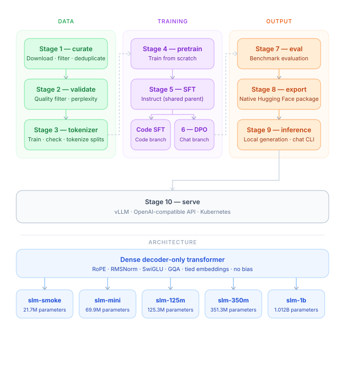

# SLM

From-scratch training pipeline for a family of dense decoder-only language
models, from corpus construction through native Hugging Face export.

[](LICENSE)

## Overview

SLM is a stage-based research pipeline for building small language models
without starting from an existing foundation-model checkpoint. It keeps data,
tokenizer, model, training, and export contracts explicit so the same workflow
can be exercised with the `mini` profile and scaled to 125M, 350M, and 1B.

The repository produces four model variants:

| Variant | Lineage | Checkpoint |
|---|---|---|
| Base | pretrained from scratch and finalized for post-training | `$RESULTS_DIR/runs/<size>/pretrain/final` |
| Instruct | base → instruct SFT | `$RESULTS_DIR/runs/<size>/sft_instruct/final` |
| Code | instruct → code SFT | `$RESULTS_DIR/runs/<size>/sft_code/final` |
| Chat | instruct → DPO | `$RESULTS_DIR/runs/<size>/dpo_chat/final` |

## Architecture



The data pipeline creates a validated corpus and size-specific BPE tokenizer.
The training pipeline initializes the decoder from scratch, then branches from
the instruct checkpoint into code-specialized and chat-aligned models. Export
converts each branch into a native Transformers Llama package for standard
inference and vLLM serving.

| Size | Parameters | Layers | Hidden size | Q/KV heads | Context |
|---|---:|---:|---:|---:|---:|
| `mini` | 22M | 6 | 384 | 6 / 2 | 1,024 |
| `125m` | 125M | 16 | 768 | 12 / 4 | 2,048 |
| `350m` | 350M | 27 | 1,024 | 16 / 8 | 2,048 |
| `1b` | 1B | 21 | 2,048 | 32 / 8 | 4,096 |

All profiles use RoPE, RMSNorm, SwiGLU, grouped-query attention,
pre-normalized residual blocks, tied token embeddings, bias-free projections,
and generation KV caching.

See [`docs/ARCHITECTURE.md`](docs/ARCHITECTURE.md) for component ownership,
model lineage, and artifact flow.

## Features

- Reproducible multi-source corpus construction with quality filtering,
  deterministic deduplication, controlled blending, completion manifests, and
  run-scoped artifact transfer.
- One byte-level BPE tokenizer contract across curation, pretraining,
  post-training, evaluation, and export.
- Hardware-aware pretraining, SFT, and DPO configuration generation based on
  model size, GPU type/count, and VRAM policy.
- Independent instruct, code, and DPO chat branches with assistant-only SFT
  loss and fixed-reference preference optimization.
- Fail-fast data, tokenizer, checkpoint, model-conversion, and CUDA
  compatibility gates.
- Native Transformers Llama export, local generation, Hub publication, and
  vLLM serving.

## Getting Started

### Prerequisites

- Ubuntu host with persistent storage for curation.
- Supported NVIDIA GPU host and CUDA-compatible driver for training.
- Hugging Face account and token.
- AWS account, S3 bucket, and credentials.
- Weights & Biases account and API key.

The curation guide lists the gated datasets whose terms must be accepted
before downloading them.

### Installation

```bash
git clone https://github.com/tohio/slm.git
cd slm
cp .env.sample .env
vi .env
```

### Configuration

Fill every variable in `.env`. Blank values, commented values, and `...`
placeholders are not supported by the complete workflows.

Verify the configuration:

```bash
make check-env
```

### Usage

Run the complete data workflow on a curation host:

```bash
make curate-all \
  SIZE=125m \
  WORKERS=62 \
  DATA_DIR=/data/slm/data
```

Record the `RUN_ID` printed when curation finishes. On a new GPU host, restore
that run and train the four model variants:

```bash
make train-all \
  SIZE=125m \
  GPUS=1 \
  RUN_ID=125m-YYYYMMDD-abcdef \
  DATA_DIR=/data/slm/data
```

Use [`docs/CURATION.md`](docs/CURATION.md) and
[`docs/TRAIN.md`](docs/TRAIN.md) for prerequisites, stage-by-stage commands,
resume procedures, outputs, evaluation, and export.

## Project Structure

```text
slm/
├── alignment/       DPO data preparation and training
├── config/          shared paths, runtime policy, data mix, and token targets
├── config_gen/      hardware-aware training configuration generation
├── curator/         source loading, filtering, deduplication, and blending
├── docs/            operational guides, architecture, and command reference
├── eval/            benchmark and deterministic behavior evaluation
├── export/          native model conversion, validation, and publication
├── finetune/        SFT data preparation and instruct/code training
├── inference/       interactive and batch generation
├── infra/           data-host and GPU-host setup and validation
├── model/           decoder-only Transformer implementation
├── pretrain/        binary tokenization and base-model training
├── serve/           vLLM launcher and Kubernetes manifests
├── tests/           CPU, GPU, artifact, and comparison checks
├── tokenizer/       BPE tokenizer training and validation
└── validation/      post-curation document validation
```

## Documentation

See [`docs/README.md`](docs/README.md) for the documentation index and
[`docs/COMMANDS.md`](docs/COMMANDS.md) for the complete Make target reference.

Related repositories:

- [`tohio/slm-synthetic-data`](https://github.com/tohio/slm-synthetic-data) —
  synthetic pretraining, SFT, DPO, and distillation data generation.
- [`tohio/slm-distillation`](https://github.com/tohio/slm-distillation) —
  response and logits distillation workflows.
- [`tohio/slm-reasoning`](https://github.com/tohio/slm-reasoning) — reasoning
  model experiments using SLM checkpoints.

## Troubleshooting

Use [`docs/TROUBLESHOOTING.md`](docs/TROUBLESHOOTING.md) for environment,
dataset access, storage, resume, artifact transfer, CUDA, and training
problems. Add new operational failure procedures there instead of expanding
the root README.

## Testing

Tests are separated into CPU contracts, environment acceptance, and checks
against existing data or model artifacts. Full curation and training are not
launched merely to test the repository.

See [`docs/TESTING.md`](docs/TESTING.md) for test order, commands, and artifact
requirements.

## License

SLM is licensed under the [MIT License](LICENSE).
